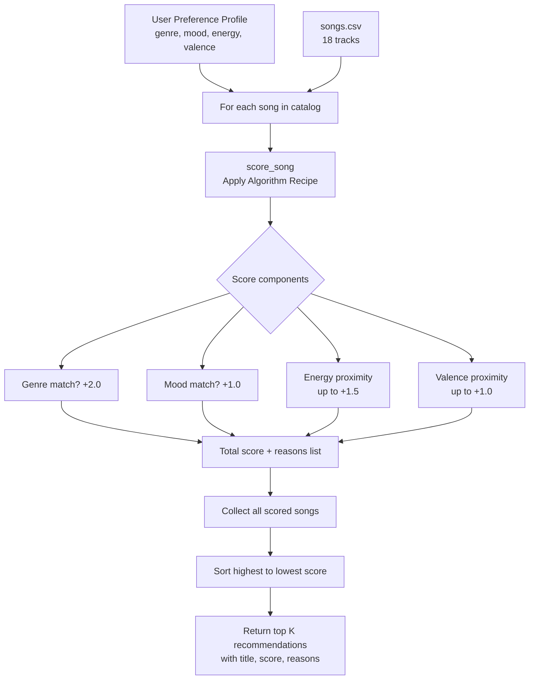

# 🎵 Music Recommender Simulation

## Project Summary

This project builds a simplified **content-based music recommender** that mirrors how platforms like Spotify suggest tracks. Given a user "taste profile" (preferred genre, mood, and energy level), it scores every song in a CSV catalog and returns the top K matches with plain-language explanations of why each song was chosen.

Real platforms like Spotify combine two major strategies:
- **Collaborative filtering** — "users who liked what you liked also liked X" — relies on aggregate behavior across millions of users.
- **Content-based filtering** — "this song has the same energy, mood, and genre you prefer" — relies purely on song attributes and a single user's profile.

This simulation uses **content-based filtering** because it works with zero user history, making it transparent and easy to reason about.

---

## How The System Works

### Features each `Song` uses

| Feature | Type | What it captures |
|---|---|---|
| `genre` | categorical | Overall musical style (pop, rock, lofi, jazz...) |
| `mood` | categorical | Emotional quality (happy, chill, intense, moody...) |
| `energy` | 0.0–1.0 | Intensity — low for ambient/lofi, high for rock/gym |
| `valence` | 0.0–1.0 | Positivity — high = uplifting, low = dark/melancholy |
| `danceability` | 0.0–1.0 | Rhythmic drive |
| `acousticness` | 0.0–1.0 | Organic (acoustic) vs electronic sound |
| `tempo_bpm` | integer | Beats per minute |

### What the `UserProfile` stores

- `favorite_genre` — the genre they want prioritized
- `favorite_mood` — the mood they are targeting
- `target_energy` — their preferred intensity level (0.0–1.0)
- `likes_acoustic` — boolean flag for acoustic vs electronic preference

### Algorithm Recipe (Scoring Rule for one song)

A song earns points based on how well it matches the user profile:

| Match | Points |
|---|---|
| Genre match | +2.0 |
| Mood match | +1.0 |
| Energy closeness | up to +1.5 (formula: `1.5 × (1 - |song.energy - target_energy|)`) |
| Valence closeness | up to +1.0 (formula: `1.0 × (1 - |song.valence - target_valence|)`) |

The numerical features use a **proximity formula** rather than a threshold — songs closest to the user's target score highest, rewarding nuance over binary matching.

### Ranking Rule

The Ranking Rule applies the Scoring Rule to every song in the catalog, collects `(song, score, reasons)` tuples, sorts them highest-to-lowest, and returns the top K. The Scoring Rule is the judge; the Ranking Rule is the tournament.

### Potential biases

- Genre matching (weight 2.0) is the dominant signal — a great song with a different genre will almost always lose to a mediocre song in the right genre.
- A small catalog (10 songs) means some profiles have very few viable matches, causing the same songs to appear repeatedly across different users.

---

## Data Flow Diagram



---

## Getting Started

### Setup

1. Create a virtual environment (optional but recommended):

   ```bash
   python -m venv .venv
   source .venv/bin/activate      # Mac or Linux
   .venv\Scripts\activate         # Windows

2. Install dependencies

```bash
pip install -r requirements.txt
```

3. Run the app:

```bash
python -m src.main
```

### Running Tests

Run the starter tests with:

```bash
pytest
```

You can add more tests in `tests/test_recommender.py`.

---

## Experiments You Tried

### Profiles Tested

| Profile | Top Result | Score | Matched Intuition? |
|---|---|---|---|
| High-Energy Pop (pop/happy/0.85) | Sunrise City | 5.44 | Yes |
| Chill Lofi (lofi/chill/0.38) | Library Rain | 5.44 | Yes |
| Deep Intense Rock (rock/intense/0.92) | Storm Runner | 5.35 | Yes |
| Adversarial (jazz/happy/0.90) | Coffee Shop Stories ← slow jazz | 3.67 | No — genre bias exposed |

### Weight Experiment: Double Energy, Halve Genre

Changed genre weight from 2.0 → 1.0 and energy weight from 1.5 → 3.0 on the adversarial profile.

- **Before:** Coffee Shop Stories (jazz, energy=0.37) ranked #1 because the genre bonus outweighed a terrible energy mismatch.
- **After:** Sunrise City (pop, energy=0.82) ranked #1 — the high-energy target was finally honored.

**Conclusion:** Genre dominance is a tunable artifact of the weights. Increasing energy importance produced more intuitive results for users whose genre preference conflicts with their energy preference.

---

## Limitations and Risks

- **Genre dominance:** A genre match (2.0 pts) can override a terrible energy or mood mismatch, leading to counterintuitive recommendations like recommending a slow jazz track to someone who wants high-energy music.
- **Small catalog:** With only 18 songs, some genres have only one track. Users in underrepresented genres have very little variety in their top-5.
- **Static taste model:** No memory of past behavior — the system cannot adapt to what the user actually skips or replays.
- **No diversity:** Top results often cluster in the same genre/mood, with no mechanism to inject variety.

You will go deeper on this in your model card.

---

## Reflection

Read and complete `model_card.md`:

[**Model Card**](model_card.md)

Write 1 to 2 paragraphs here about what you learned:

- about how recommenders turn data into predictions
- about where bias or unfairness could show up in systems like this


---

## 7. `model_card_template.md`

Combines reflection and model card framing from the Module 3 guidance. :contentReference[oaicite:2]{index=2}  

```markdown
# 🎧 Model Card - Music Recommender Simulation

## 1. Model Name

Give your recommender a name, for example:

> VibeFinder 1.0

---

## 2. Intended Use

- What is this system trying to do
- Who is it for

Example:

> This model suggests 3 to 5 songs from a small catalog based on a user's preferred genre, mood, and energy level. It is for classroom exploration only, not for real users.

---

## 3. How It Works (Short Explanation)

Describe your scoring logic in plain language.

- What features of each song does it consider
- What information about the user does it use
- How does it turn those into a number

Try to avoid code in this section, treat it like an explanation to a non programmer.

---

## 4. Data

Describe your dataset.

- How many songs are in `data/songs.csv`
- Did you add or remove any songs
- What kinds of genres or moods are represented
- Whose taste does this data mostly reflect

---

## 5. Strengths

Where does your recommender work well

You can think about:
- Situations where the top results "felt right"
- Particular user profiles it served well
- Simplicity or transparency benefits

---

## 6. Limitations and Bias

Where does your recommender struggle

Some prompts:
- Does it ignore some genres or moods
- Does it treat all users as if they have the same taste shape
- Is it biased toward high energy or one genre by default
- How could this be unfair if used in a real product

---

## 7. Evaluation

How did you check your system

Examples:
- You tried multiple user profiles and wrote down whether the results matched your expectations
- You compared your simulation to what a real app like Spotify or YouTube tends to recommend
- You wrote tests for your scoring logic

You do not need a numeric metric, but if you used one, explain what it measures.

---

## 8. Future Work

If you had more time, how would you improve this recommender

Examples:

- Add support for multiple users and "group vibe" recommendations
- Balance diversity of songs instead of always picking the closest match
- Use more features, like tempo ranges or lyric themes

---

## 9. Personal Reflection

A few sentences about what you learned:

- What surprised you about how your system behaved
- How did building this change how you think about real music recommenders
- Where do you think human judgment still matters, even if the model seems "smart"

